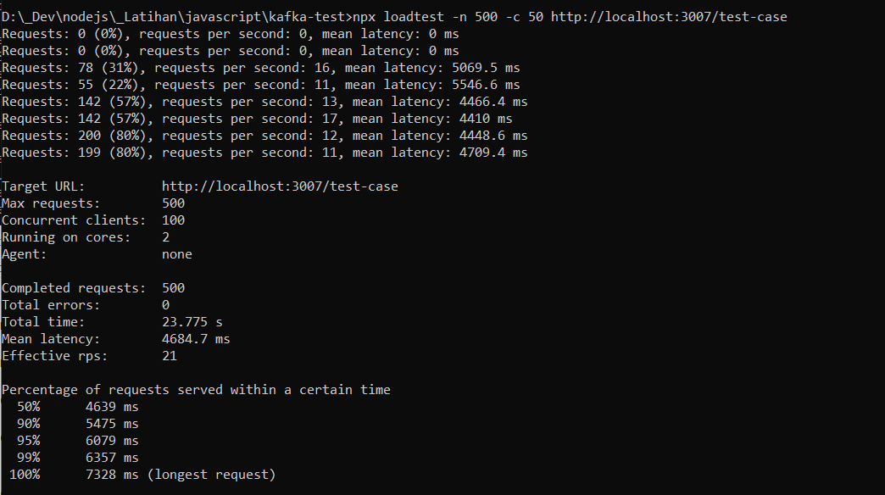
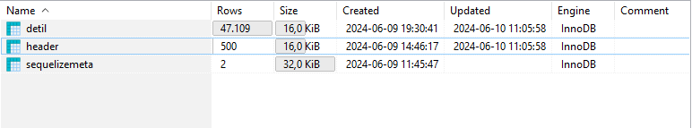

# test-case
Test Case Backend AKT

## 💻 Tech Stack
- **node.js** - evented I/O for the backend
- **Express** - fast node.js network app framework
- **MySQL** - Databases
- **Sequelize** - Node.js Database ORM
- **winston** - Logger for Node.js
- **Kafka** - Distributed event streaming
- [**loadtest**](https://www.npmjs.com/package/loadtest) - Runs a load test on the selected HTTP or WebSockets URL. 

## 📋  How to

Running Application
```sh
npm run start
```

Running Kafka Consumer
```sh
npm run consumer <KAFKA_GROUP_NAME>
```

Running loadtest
```sh
npx loadtest -n 50 -c 10 http://localhost:3007/test-case
```

## 📝 Result (Local Test)
- Max Request = 500, Concurrent = 100

| Screenshots                                   | Notes                                                     |
|-----------------------------------------------|-----------------------------------------------------------|
|  | npx loadtest -n 500 -c 50 http://localhost:3007/test-case |
|    | Database Insert                                           |


### 🚀 Author
[Estu Dwiyanto](https://github.com/estudui)
